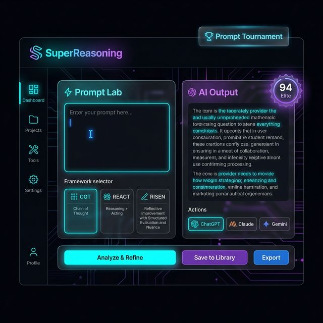

<div align="center">



# ⚡ SuperReasoning

**AI Mühendisliği & Prompt Yönetim Platformu**

[](https://github.com/turkmen-coder/superreasoning)
[](LICENSE)
[](https://www.typescriptlang.org/)
[](https://react.dev/)

*Profesyonel prompt mühendisliği için kapsamlı platform — 30+ framework, multi-provider AI, analitik ve çok daha fazlası.*

</div>

---

## 🎯 Nedir?

SuperReasoning; prompt tasarımını, testini, puanlamasını ve yönetimini tek bir platformda birleştiren bir AI mühendisliği aracıdır. Birden fazla AI sağlayıcısıyla çalışır, prompt kalitesini otomatik puanlar ve gelişmiş üretkenlik araçları sunar.

---

## ✨ Özellikler

### 🧠 Prompt Üretimi
| Özellik | Detay |
|---|---|
| **30+ Framework** | COT, REACT, RISEN, KERNEL, RTF, CO-STAR, TAG, BAB, CARE, APE, DSP, REWOO... |
| **Multi-Provider** | OpenAI, Anthropic (Claude), Gemini, OpenRouter, Groq, DeepSeek, HuggingFace |
| **Agent Modu** | Otomatik intent analizi, framework önerisi ve multi-step refinement |
| **Sistem Promptu** | Özelleştirilebilir sistem promptu + hazır presetler |

### 📊 Kalite & Analiz
| Özellik | Detay |
|---|---|
| **Judge Panel** | Çok boyutlu otomatik puanlama (0-100) — Elite/Pro/Good/Basic sınıflandırma |
| **A/B Diff Viewer** | İki prompt arası satır bazlı karşılaştırma |
| **Prompt Turnuvası** | COT vs REACT vs RISEN — kazananı otomatik seç |
| **Analitik Dashboard** | Kullanım istatistikleri, domain dağılımı, skor trend |

### 🔧 Üretkenlik Araçları
| Özellik | Detay |
|---|---|
| **⌨️ Command Palette** | `Cmd+K` — her aksiyona anında eriş |
| **📦 Batch İşlem** | Çok satır intent → toplu üretim → JSON/CSV export |
| **🎯 Few-Shot Üreteci** | Prompt için otomatik 3 örnek INPUT/OUTPUT üretimi |
| **🏆 Prompt Turnuvası** | 3 framework yarıştır, kazananı AI puan versin |
| **🔗 Webhook/Zapier** | Generate/copy/export olaylarında otomatik trigger |
| **🎤 Ses Girişi** | Web Speech API ile Türkçe/İngilizce ses ile intent yaz |

### 🎨 Arayüz
| Özellik | Detay |
|---|---|
| **⬜ Split View** | Input solda, result sağda — geniş ekran verimliliği |
| **🌙☀️ Dark/Light Mode** | Tek tıkla tema geçişi |
| **🎨 Tema Rengi** | 6 preset accent rengi + custom color picker |
| **🗂️ Sidebar Collapse** | İkon-only daralt, ekran alanını artır |
| **🖱️ Sağ Tık Menüsü** | Result üzerinde kopyala/AI'da aç/diff seçenekleri |

### 🤖 AI'da Aç
Prompt üretildiğinde tek tıkla 8 farklı AI platformuna gönder:

> **ChatGPT** · **Claude** · **Gemini** · **Perplexity** · **Phind** · **DeepSeek** · **Le Chat** · **Grok**

### 📚 Template Kütüphanesi
- **30 hazır şablon** (Frontend, Backend, DevOps, ML, Security, Blockchain, Healthcare...)
- Kart grid + domain emoji ikonları
- Fuzzy arama ve kategori filtresi
- Hover preview pane
- ⭐ Favoriler ve 📋 Son kullanılanlar (localStorage)

### 🔒 Güvenlik
- **Prompt Injection Tarayıcı** — "ignore previous instructions", jailbreak kalıplarını tespit
- **Token Bütçe Göstergesi** — provider bazlı limit takibi
- OWASP uyumlu API tasarımı

---

## 🚀 Kurulum

### Gereksinimler
- Node.js 18+
- npm veya yarn

### Adımlar

```bash
# Klonla
git clone https://github.com/turkmen-coder/superreasoning.git
cd superreasoning

# Bağımlılıkları yükle
npm install

# Ortam dosyasını hazırla
cp .env.example .env
# .env dosyasına API key'lerini ekle

# Geliştirme sunucusunu başlat
npm run dev:all
```

Uygulama açılacak adresler:
- **Frontend:** http://localhost:3000
- **Backend API:** http://localhost:4000

---

## ⚙️ Ortam Değişkenleri

`.env` dosyasına ekleyin:

```env
# OpenAI
VITE_OPENAI_API_KEY=sk-...

# Anthropic (Claude)
VITE_ANTHROPIC_API_KEY=sk-ant-...

# Google Gemini
VITE_GEMINI_API_KEY=...

# OpenRouter (opsiyonel — 100+ model)
VITE_OPENROUTER_API_KEY=...

# Groq (opsiyonel — hızlı inference)
VITE_GROQ_API_KEY=...
```

---

## 📁 Proje Yapısı

```
superreasoning/
├── src/
│   ├── App.tsx                    # Ana uygulama
│   ├── components/                # UI bileşenleri (40+)
│   │   ├── CommandPalette.tsx     # Cmd+K komut paleti
│   │   ├── BatchProcessor.tsx     # Toplu işlem
│   │   ├── FewShotGenerator.tsx   # Few-shot örnek üreteci
│   │   ├── PromptTournament.tsx   # Framework yarışması
│   │   ├── TemplateSelector.tsx   # 30 şablon kütüphanesi
│   │   ├── ThemeCustomizer.tsx    # Tema rengi
│   │   └── ...
│   ├── hooks/                     # Custom React hooks
│   └── types.ts                   # TypeScript tipleri
├── services/                      # AI provider servisleri
│   ├── unifiedProviderService.ts  # Tek API arayüzü
│   ├── judgeEnsemble.ts           # Otomatik puanlama
│   └── orchestrator.ts            # Workflow motor
├── server/                        # Express.js backend
├── data/
│   └── templates.ts               # 30 prompt şablonu
└── components/                    # Paylaşılan bileşenler
    └── FrameworkSelector.tsx
```

---

## 🛠️ Teknik Yığın

| Katman | Teknoloji |
|---|---|
| **Frontend** | React 18, TypeScript, Vite, TailwindCSS |
| **Backend** | Node.js, Express, tsx |
| **State** | useReducer + Context |
| **Depolama** | localStorage + Supabase (opsiyonel) |
| **Vector DB** | In-memory (zvec fallback) |
| **Gerçek zamanlı** | WebSocket (işbirlikçi düzenleme) |

---

## ⌨️ Klavye Kısayolları

| Kısayol | Aksiyon |
|---|---|
| `Ctrl/Cmd + Enter` | Prompt üret |
| `Ctrl/Cmd + K` | Command Palette aç |
| `1-7` | Sayfa geçişi |
| `?` | Kısayol listesi |

---

## 📄 Lisans

MIT © [turkmen-coder](https://github.com/turkmen-coder)

---

<div align="center">
  <sub>⚡ SuperReasoning — Prompt mühendisliğini bir üst seviyeye taşı</sub>
</div>
