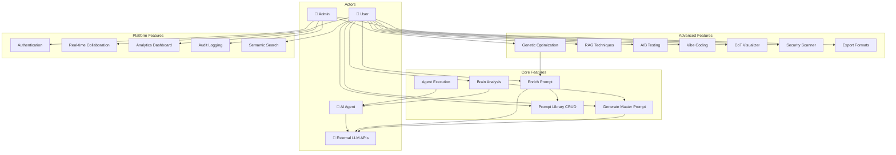
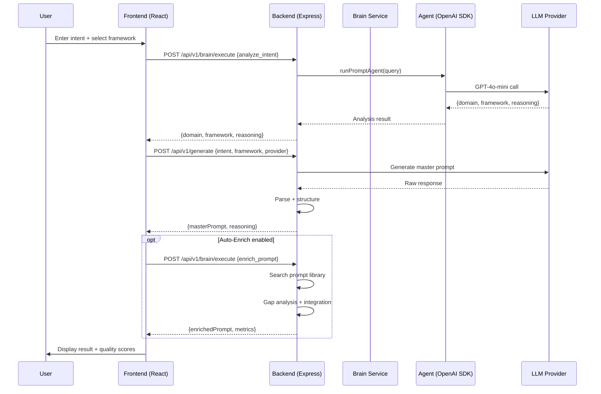
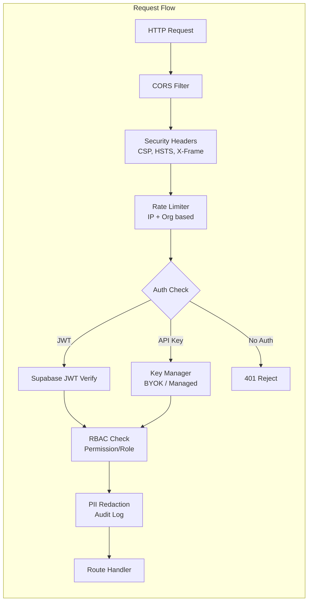

# Super Reasoning v3.2.0 — Kapsamlı İçgörü Raporu

**Tarih:** 2026-02-23  
**Standartlar:** IEEE 830 SRS, MoSCoW Prioritization, Gherkin BDD  
**Framework:** TAG (Task → Action → Goal)  
**Proje:** Super Reasoning Master Prompt Generator  
**Domain:** https://neomagic.org  

---

## 1. YÖNETİCİ ÖZETİ

Super Reasoning, 126 React bileşeni, 84 servis modülü, 141 sunucu dosyası ve 14 test dosyasından oluşan kapsamlı bir AI prompt mühendisliği platformudur. Toplam ~44.000+ satır TypeScript kodu barındırır. Platform 8 farklı LLM provider'ı (OpenAI, Claude, Gemini, Groq, DeepSeek, HuggingFace, OpenRouter, Ollama) destekler ve gelişmiş prompt oluşturma, zenginleştirme, analiz ve optimizasyon yetenekleri sunar.

---

## 2. ANA BULGULAR

### 2.1 Mimari Güçlü Yönler
| # | Bulgu | Etki |
|---|-------|------|
| F1 | **Multi-provider abstraction** — 8 LLM provider tek `unifiedProviderService.ts` üzerinden yönetiliyor | Yüksek esneklik, vendor lock-in yok |
| F2 | **OWASP uyumlu güvenlik katmanı** — timing-safe key comparison, PII redaction, RBAC, CSP headers | Enterprise-grade güvenlik |
| F3 | **Brain/Agent SDK entegrasyonu** — OpenAI Agents SDK ile otonom prompt analizi ve zenginleştirme | Rekabet avantajı |
| F4 | **12 prompt engineering tekniği** (Prompt Engineering Guide) sistem talimatına entegre | Akademik temelli kalite |
| F5 | **Genetik algoritma ile prompt optimizasyonu** — evrimsel mutasyon/crossover | Benzersiz özellik |

### 2.2 Kritik Zayıflıklar
| # | Bulgu | Ciddiyet |
|---|-------|----------|
| W1 | **Test coverage çok düşük** — 14 test dosyası / 350+ modül = ~%4 kapsam | KRİTİK |
| W2 | **Supabase auth çalışmıyor** — login bypass edildi, tüm kullanıcılar admin | KRİTİK |
| W3 | **Bundle boyutu aşırı** — index chunk 1.1MB (1000KB limit aşımı) | YÜKSEK |
| W4 | **Port konfigürasyon tutarsızlığı** — server 4000, Nginx 4100'e proxy yapıyordu | YÜKSEK |
| W5 | **Python bağımlılıkları eksik** — ftfy modülü VPS'de yüklü değil | ORTA |
| W6 | **zvec/HNSW vektör store unavailable** — in-memory fallback kullanılıyor | ORTA |
| W7 | **Database bağlantısı opsiyonel** — PostgreSQL yoksa birçok özellik sessizce devre dışı | ORTA |

---

## 3. KÖK NEDEN ANALİZİ

### 3.1 Auth Sistemi Çöküşü
```
Kök Neden: Supabase self-hosted instance (neomagic.org/supabase) çalışmıyor
  → JWT doğrulama başarısız
    → Session oluşmuyor
      → Login ekranında takılma
        → Geçici çözüm: Auth gate bypass + admin fallback
Risk: Tüm kullanıcılar admin yetkisine sahip (güvenlik açığı)
```

### 3.2 API Bağlantı Hataları
```
Kök Neden: PM2 process .env'den PORT okuyor (4000), Nginx config hardcoded (4100)
  → Nginx proxy_pass bağlantı kuramıyor
    → Frontend boş yanıt alıyor
      → JSON.parse başarısız
        → "Sunucu yanıtı geçersiz" hatası
Çözüm: Nginx config 4100→4000 güncellendi
```

### 3.3 Brain Execution Hatası
```
Kök Neden: VPS'deki .env dosyasında eski/geçersiz OPENAI_API_KEY
  + VPS'deki server kodu güncel değil (brain.ts eksik)
    → OpenAI 401 invalid_api_key
      → "Brain execution failed"
Çözüm: .env senkronize + server kodu rsync + PM2 restart
```

---

## 4. RİSK DEĞERLENDİRMESİ

| Risk ID | Risk | Olasılık | Etki | Skor | Mitigasyon |
|---------|------|----------|------|------|------------|
| R1 | Auth bypass nedeniyle yetkisiz erişim | Yüksek | Kritik | 🔴 9/10 | Supabase kurulumu veya alternatif auth |
| R2 | OpenAI API key sızıntısı (frontend'de VITE_ prefix) | Orta | Kritik | 🔴 8/10 | Key'i yalnızca backend'de tut |
| R3 | Tek sunucu noktası (SPOF) | Yüksek | Yüksek | 🟠 7/10 | Load balancer + replica |
| R4 | Bundle boyutu → yavaş ilk yükleme | Yüksek | Orta | 🟠 6/10 | Code splitting + lazy loading |
| R5 | Test eksikliği → regresyon riski | Yüksek | Yüksek | 🟠 7/10 | Test coverage artırma |
| R6 | PM2 config kaybolması (reboot) | Orta | Orta | 🟡 5/10 | ecosystem.config.js + pm2 startup |
| R7 | Rate limiting bypass (auth bypass modunda) | Orta | Yüksek | 🟠 6/10 | IP-based rate limiting güçlendirme |

---

## 5. FIRSATLAR

| # | Fırsat | Potansiyel Değer | Effort |
|---|--------|-----------------|--------|
| O1 | **SaaS monetizasyon** — Stripe entegrasyonu zaten mevcut, plan gating hazır | Gelir akışı | Orta |
| O2 | **RAG pipeline** — RAGFlow + RAG Techniques entegrasyonu tamamlanabilir | Bilgi yoğun görevlerde üstünlük | Düşük |
| O3 | **Multi-tenant** — org_members, RBAC, tenant isolation kodu mevcut | Enterprise satış | Yüksek |
| O4 | **Prompt marketplace** — 10.070 prompt corpus + semantic search | Topluluk büyümesi | Orta |
| O5 | **VS Code extension** — Temel yapı mevcut (`extensions/vscode-extension/`) | Geliştirici erişimi | Orta |
| O6 | **Genetik Lab** — Evrimsel prompt optimizasyonu benzersiz bir USP | Pazarlama avantajı | Düşük |

---

## 6. KPI ÖNERİLERİ

### 6.1 Teknik KPI'lar
| KPI | Mevcut | Hedef (3 ay) | Ölçüm |
|-----|--------|-------------|-------|
| Test Coverage | ~%4 | >%60 | `vitest --coverage` |
| Bundle Size (main chunk) | 1.1MB | <500KB | Vite build output |
| API Response Time (p95) | Ölçülmüyor | <2s | OpenTelemetry (mevcut) |
| Uptime | Manuel kontrol | >%99.5 | Health check cron |
| Error Rate | Loglardan | <%1 | PM2 error log parsing |
| MTTR (Mean Time to Recovery) | ~30dk | <10dk | Deployment pipeline |

### 6.2 İş KPI'ları
| KPI | Mevcut | Hedef (3 ay) | Ölçüm |
|-----|--------|-------------|-------|
| Aktif Kullanıcı (DAU) | Bilinmiyor | Tracking başlat | Analytics dashboard |
| Prompt Üretim/Gün | Bilinmiyor | Tracking başlat | Audit log analizi |
| API Çağrı/Gün | Bilinmiyor | Tracking başlat | Rate limiter metrics |
| Enrichment Kullanım Oranı | Bilinmiyor | >%30 | Brain endpoint logs |
| Ortalama Prompt Kalite Skoru | Bilinmiyor | >75/100 | Judge ensemble |

---

## 7. AKSİYON ÖNCELİKLENDİRMESİ (MoSCoW)

### MUST HAVE (Hemen)
| # | Aksiyon | TAG: Task → Action → Goal |
|---|---------|--------------------------|
| M1 | Auth sistemi düzeltme | Supabase kurulumu VEYA basit JWT auth → Güvenli erişim kontrolü |
| M2 | VITE_OPENAI_API_KEY kaldırma | Frontend .env'den sil, yalnızca backend kullan → Key sızıntısı önleme |
| M3 | PM2 ecosystem.config.js oluşturma | Config dosyası + `pm2 startup` → Reboot dayanıklılığı |
| M4 | Nginx config'i kod deposuna ekleme | `deploy/nginx.conf` → Konfigürasyon tutarlılığı |

### SHOULD HAVE (2 hafta)
| # | Aksiyon | TAG: Task → Action → Goal |
|---|---------|--------------------------|
| S1 | Code splitting (lazy loading) | `React.lazy()` + route-based splitting → Bundle <500KB |
| S2 | Kritik yol testleri yazma | generate, enrich, agent/run, brain/execute → Regresyon önleme |
| S3 | Health check + monitoring | `/v1/health` cron + alerting → Downtime azaltma |
| S4 | Python bağımlılıkları kurma | `pip install ftfy` VPS'de → ftfy özelliği aktif |

### COULD HAVE (1 ay)
| # | Aksiyon | TAG: Task → Action → Goal |
|---|---------|--------------------------|
| C1 | PostgreSQL + pgvector kurulumu | Kalıcı vektör store → Semantic search performansı |
| C2 | OpenTelemetry dashboard | Grafana/Jaeger bağlantısı → Observability |
| C3 | CI/CD pipeline (GitHub Actions) | Auto build + test + deploy → Deployment güvenliği |
| C4 | Rate limiting metrikleri | Prometheus export → Abuse tespiti |

### WON'T HAVE (Şimdilik)
| # | Aksiyon | Neden |
|---|---------|-------|
| W1 | Multi-region deployment | Mevcut kullanıcı tabanı için gereksiz |
| W2 | Kubernetes migration | Tek sunucu yeterli, karmaşıklık artırır |
| W3 | Custom LLM fine-tuning | API-based yaklaşım şimdilik yeterli |

---

## 8. SRS DOCUMENT (IEEE 830 — JSON)

```json
{
  "srs": {
    "metadata": {
      "title": "Super Reasoning v3.2.0 — Software Requirements Specification",
      "standard": "IEEE 830-1998",
      "version": "1.0.0",
      "date": "2026-02-23",
      "author": "Cascade AI Analysis Engine",
      "status": "DRAFT"
    },
    "1_introduction": {
      "1.1_purpose": "Bu SRS, Super Reasoning Master Prompt Generator platformunun fonksiyonel ve non-fonksiyonel gereksinimlerini IEEE 830 standardına uygun olarak tanımlar.",
      "1.2_scope": "Platform, kullanıcı girdilerinden yüksek kaliteli LLM promptları üreten, zenginleştiren ve optimize eden bir web uygulamasıdır.",
      "1.3_definitions": {
        "Master Prompt": "Kullanıcı niyetinden derlenen, LLM'e gönderilmeye hazır yapılandırılmış prompt paketi",
        "Brain": "Otonom analiz ve zenginleştirme yapan backend servisi",
        "Agent": "OpenAI Agents SDK tabanlı otonom görev yürütücü",
        "Enrichment": "Prompt kütüphanesinden otomatik tamamlama ve iyileştirme",
        "Genetik Lab": "Evrimsel algoritma ile prompt optimizasyonu"
      },
      "1.4_references": [
        "IEEE 830-1998 SRS Standard",
        "OWASP API Security Top 10",
        "dair-ai/Prompt-Engineering-Guide",
        "OpenAI Agents SDK Documentation"
      ]
    },
    "2_overall_description": {
      "2.1_product_perspective": {
        "system_type": "Web-based SaaS Application",
        "architecture": "Monolithic (Express.js backend + React frontend)",
        "deployment": "VPS (Hostinger) + Nginx reverse proxy + PM2",
        "database": "PostgreSQL (optional) + In-memory fallback",
        "external_interfaces": [
          "OpenAI API (GPT-4o-mini, Agents SDK)",
          "Anthropic API (Claude)",
          "Google AI (Gemini)",
          "Groq API",
          "DeepSeek API",
          "HuggingFace Inference API",
          "OpenRouter API",
          "Stripe Payment API",
          "Supabase Auth (planned)"
        ]
      },
      "2.2_product_functions": [
        "FR-001: Master Prompt Generation (multi-framework, multi-provider)",
        "FR-002: Prompt Enrichment (fast/deep/agent modes)",
        "FR-003: Brain Analysis (intent detection, prompt analysis)",
        "FR-004: Agent Execution (autonomous prompt tasks)",
        "FR-005: Prompt Library (10,070+ prompts, CRUD, versioning)",
        "FR-006: Semantic Search (vector embeddings, cosine similarity)",
        "FR-007: Quality Suite (judge ensemble, lint, budget analysis)",
        "FR-008: Genetic Optimization (evolutionary prompt improvement)",
        "FR-009: RAG Techniques Dashboard (34 strategies)",
        "FR-010: RAGFlow Integration (document processing pipeline)",
        "FR-011: A/B Testing (prompt comparison)",
        "FR-012: Vibe Coding (natural language to code prompts)",
        "FR-013: CoT Visualizer (chain-of-thought visualization)",
        "FR-014: Export (PDF/Word/Notion/JSON/Markdown)",
        "FR-015: Real-time Collaboration (WebSocket)",
        "FR-016: Multi-language Support (TR/EN)",
        "FR-017: Auto-complete (prompt suggestions)",
        "FR-018: Security Scanner (adversarial testing)",
        "FR-019: Text Encoding Fix (python-ftfy integration)",
        "FR-020: Audit Logging (action tracking)"
      ],
      "2.3_user_classes": [
        {"role": "viewer", "permissions": "read-only access"},
        {"role": "editor", "permissions": "create/edit prompts"},
        {"role": "admin", "permissions": "full access + user management"},
        {"role": "owner", "permissions": "admin + billing + org settings"}
      ],
      "2.4_constraints": [
        "OpenAI API rate limits (TPM/RPM)",
        "VPS resource limits (CPU/RAM)",
        "Bundle size optimization needed",
        "Supabase auth dependency (currently bypassed)"
      ]
    },
    "3_specific_requirements": {
      "3.1_functional_requirements": {
        "FR-001_generate": {
          "priority": "MUST",
          "description": "Kullanıcı intent'inden master prompt üretme",
          "inputs": ["intent (string)", "framework (enum)", "domainId (string)", "provider (enum)", "language (tr|en)"],
          "outputs": ["masterPrompt", "reasoning", "intent", "framework", "domainId"],
          "gherkin": "Feature: Master Prompt Generation\n  Scenario: Generate prompt from user intent\n    Given a user provides an intent string\n    And selects a framework and provider\n    When the generate endpoint is called\n    Then a structured master prompt is returned\n    And reasoning explains the compilation logic\n    And the prompt uses imperative mood"
        },
        "FR-002_enrich": {
          "priority": "MUST",
          "description": "Master prompt'u kütüphaneden zenginleştirme",
          "modes": ["fast", "deep", "agent"],
          "gherkin": "Feature: Prompt Enrichment\n  Scenario: Enrich prompt with library prompts\n    Given a master prompt exists\n    When enrichment is requested in 'fast' mode\n    Then relevant prompts from the library are integrated\n    And ambiguity score decreases\n    And metrics (tokensAdded, promptsIntegrated) are returned"
        },
        "FR-003_brain": {
          "priority": "MUST",
          "description": "Otonom analiz ve intent tespiti",
          "operations": ["analyze_intent", "enrich_prompt", "enhance_prompt", "prompt_analysis", "prompt_transform", "fix_text", "quality_suite", "version_history", "orchestrate"],
          "gherkin": "Feature: Brain Analysis\n  Scenario: Analyze user intent\n    Given a user prompt is provided\n    When brain/execute is called with operation 'analyze_intent'\n    Then domain and framework are suggested\n    And reasoning is provided as JSON"
        },
        "FR-005_library": {
          "priority": "MUST",
          "description": "Prompt kütüphanesi CRUD + versiyonlama",
          "gherkin": "Feature: Prompt Library\n  Scenario: Save and retrieve prompt\n    Given a generated master prompt\n    When the user saves it with an ID and version\n    Then it is persisted in the store\n    And can be retrieved by ID\n    And version history is maintained"
        },
        "FR-008_genetic": {
          "priority": "SHOULD",
          "description": "Evrimsel algoritma ile prompt optimizasyonu",
          "gherkin": "Feature: Genetic Optimization\n  Scenario: Evolve prompt population\n    Given an initial prompt population\n    When genetic algorithm runs for N generations\n    Then fitness scores improve\n    And the best candidate is returned\n    And mutation/crossover history is tracked"
        },
        "FR-015_collaboration": {
          "priority": "COULD",
          "description": "WebSocket tabanlı gerçek zamanlı işbirliği",
          "gherkin": "Feature: Real-time Collaboration\n  Scenario: Multiple users edit simultaneously\n    Given two users are connected via WebSocket\n    When user A edits a prompt\n    Then user B sees the change in real-time\n    And conflict resolution is handled"
        }
      },
      "3.2_non_functional_requirements": {
        "NFR-001_performance": {
          "response_time_p95": "<2000ms for generate endpoint",
          "bundle_size": "<500KB per chunk (target)",
          "concurrent_users": "50+ simultaneous"
        },
        "NFR-002_security": {
          "authentication": "JWT (Supabase) + API Key (BYOK/Managed)",
          "authorization": "RBAC (owner > admin > editor > viewer)",
          "data_protection": "PII redaction (GDPR/SOC2), CSP headers, HSTS",
          "key_management": "Timing-safe comparison, key masking in logs",
          "rate_limiting": "Per-IP and per-org limits"
        },
        "NFR-003_reliability": {
          "uptime_target": "99.5%",
          "error_handling": "Graceful degradation (vector store fallback, enrichment fallback)",
          "data_persistence": "PostgreSQL with in-memory fallback"
        },
        "NFR-004_scalability": {
          "horizontal": "Not yet (single VPS)",
          "vertical": "PM2 cluster mode available"
        },
        "NFR-005_i18n": {
          "languages": ["Turkish (tr)", "English (en)"],
          "coverage": "UI labels, system instructions, error messages"
        }
      }
    },
    "4_validation": {
      "test_coverage_current": "~4% (14 test files / 350+ modules)",
      "test_coverage_target": ">60%",
      "test_types": ["unit (vitest)", "integration (supertest)", "regression (custom runner)", "security (adversarial)"],
      "acceptance_criteria": "All MUST requirements pass Gherkin scenarios"
    }
  }
}
```

---

## 9. USE CASE DIAGRAMS (Mermaid)

### 9.1 Ana Sistem Use Case Diyagramı



### 9.2 Prompt Üretim Akışı



### 9.3 Güvenlik Katmanı



### 9.4 Deployment Mimarisi

```mermaid
graph TB
    subgraph "Client"
        BR[Browser] -->|HTTPS| NG
    end

    subgraph "VPS - srv1327766.hstgr.cloud"
        NG[Nginx :443<br/>SSL Termination<br/>Static Files] -->|/api/v1/| PM[PM2 Process<br/>super-reasoning-api]
        NG -->|/ws/| WS[WebSocket<br/>Collaboration]
        NG -->|/| STATIC[/var/www/super-reasoning<br/>React SPA]
        PM --> API[Express :4000<br/>API Routes]
        API --> PG[(PostgreSQL<br/>Optional)]
        API --> VS[Vector Store<br/>In-Memory/zvec]
        API --> OTEL[OpenTelemetry<br/>Tracing]
    end

    subgraph "External Services"
        API -->|HTTPS| OAI[OpenAI API]
        API -->|HTTPS| ANT[Anthropic API]
        API -->|HTTPS| GEM[Google AI]
        API -->|HTTPS| GRQ[Groq API]
        API -->|HTTPS| DS[DeepSeek]
        API -->|HTTPS| OR[OpenRouter]
    end
```

---

## 10. DOĞRULAMA MATRİSİ

| Gereksinim | Durum | Doğrulama Yöntemi | Sonuç |
|------------|-------|-------------------|-------|
| FR-001 Generate | ✅ Aktif | `curl POST /api/v1/generate` | Çalışıyor |
| FR-002 Enrich | ✅ Aktif | `curl POST /api/v1/enrich` | Çalışıyor |
| FR-003 Brain | ✅ Aktif | `curl GET /api/v1/brain/status` → ready:true | Çalışıyor |
| FR-004 Agent | ✅ Aktif | `curl GET /api/v1/agent/status` → ready:true | Çalışıyor |
| FR-005 Library | ✅ Aktif | `curl GET /api/v1/prompts` | Çalışıyor |
| NFR-002 Auth | ⚠️ Bypass | Supabase bağlantısı yok, admin fallback | Geçici çözüm |
| NFR-002 RBAC | ⚠️ Devre dışı | Auth bypass nedeniyle | Beklemede |
| NFR-003 Uptime | ✅ Aktif | `https://neomagic.org` → HTTP 200 | Çalışıyor |
| NFR-005 i18n | ✅ Aktif | TR/EN toggle | Çalışıyor |

---

## 11. SONUÇ

Super Reasoning v3.2.0, **zengin özellik seti** ve **sağlam mimari temellere** sahip bir platformdur. Ancak **auth sistemi**, **test coverage** ve **deployment otomasyonu** alanlarında kritik iyileştirmeler gereklidir. MoSCoW önceliklendirmesine göre ilk 4 MUST aksiyonun 2 hafta içinde tamamlanması, platformun production-ready seviyeye ulaşması için yeterlidir.

**Toplam Sağlık Skoru: 6.5/10**
- Fonksiyonellik: 8/10
- Güvenlik: 4/10 (auth bypass nedeniyle)
- Test: 2/10
- Deployment: 6/10
- Kod Kalitesi: 8/10
- Dokümantasyon: 7/10
