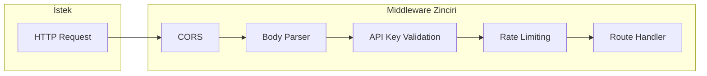
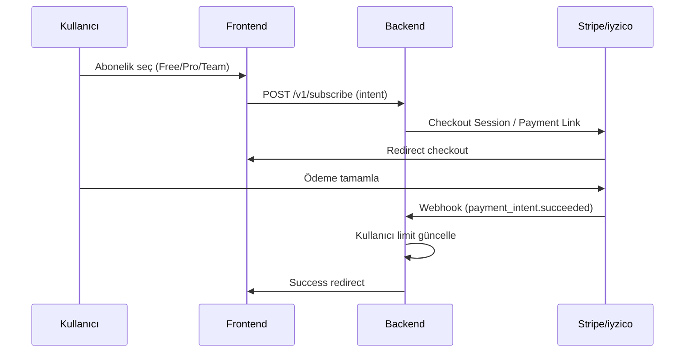
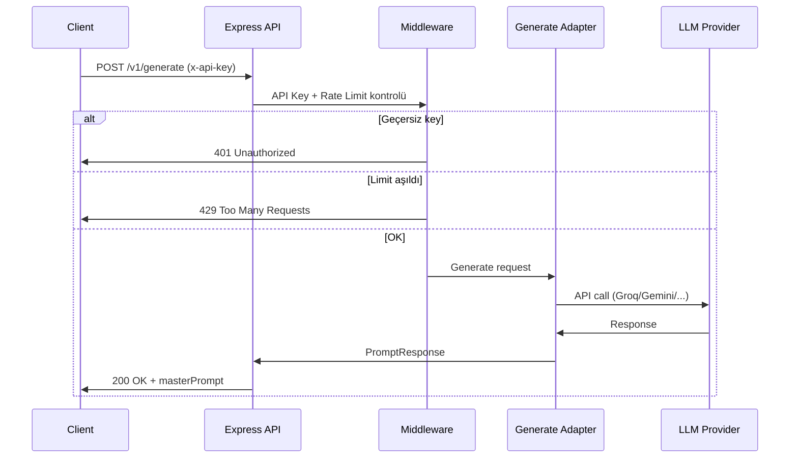

# Super Reasoning — Teknik Mimari Dokümanı

Bu doküman, Super Reasoning SaaS platformunun frontend, backend, ödeme ve güvenlik katmanlarını tanımlar.

---

## 1. Mimari Diyagram (Mermaid)

### 1.1 Genel Akış

```mermaid
flowchart TB
    subgraph Client["Kullanıcı Tarayıcısı"]
        UI[Vite/React Frontend]
        BYOK[Bring Your Own Key]
    end

    subgraph CDN["CDN / Edge"]
        Vercel[Vercel / Netlify]
    end

    subgraph Backend["Backend (Railway / Render)"]
        API[Express API :4000]
        Auth[API Key Middleware]
        RateLimit[Rate Limit]
        Gen[Generate Adapter]
        Store[(Prompt Store)]
        Payment[Payment Service]
    end

    subgraph External["Harici Servisler"]
        Stripe[Stripe / iyzico]
        Groq[Groq API]
        Gemini[Gemini API]
        HF[Hugging Face]
        Claude[Claude API]
        OR[OpenRouter]
    end

    UI -->|HTTPS| Vercel
    Vercel -->|Static + SPA| UI
    UI -->|API calls x-api-key| API
    BYOK -->|User keys (frontend only)| UI

    API --> Auth
    Auth --> RateLimit
    RateLimit --> Gen
    RateLimit --> Store
    Gen --> Groq
    Gen --> Gemini
    Gen --> HF
    Gen --> Claude
    Gen --> OR

    Payment --> Stripe
    API --> Payment
```

### 1.2 Güvenlik Katmanları



### 1.3 Ödeme ve Abonelik Akışı



### 1.4 Veri Akışı (Prompt Üretimi)



---

## 2. Bileşenler

| Bileşen | Teknoloji | Hosting |
|---------|-----------|---------|
| Frontend | Vite + React | Vercel / Netlify |
| Backend API | Express.js | Railway / Render |
| Ödeme | Stripe (global) / iyzico (TR) | SaaS |
| LLM | Groq, Gemini, HF, Claude, OpenRouter | Harici API |

---

## 3. Güvenlik (OWASP Uyumluluk)

- **API Key Yönetimi:** Header `x-api-key`; sunucuda hash ile doğrulama; loglarda asla düz metin key.
- **Rate Limiting:** Dakika başına istek limiti; plan bazlı (Free: 10/dk, Pro: 100/dk).
- **CORS:** Sadece izin verilen origin'ler (production domain).
- **Input Validation:** Body size limit (1MB); intent max 50.000 karakter.
- **HTTPS:** Tüm trafik TLS üzerinden.

---

## 4. Deployment

- **Frontend:** `npm run build` → `dist/` → Vercel/Netlify static host.
- **Backend:** `tsx server/index.ts` veya `node dist/server/index.js` → Railway/Render.
- **Env:** `SR_API_PORT`, `API_KEYS_HASH` (bcrypt), `STRIPE_SECRET_KEY`, vb.

---

---

## 5. İlgili dokümanlar

| Doküman | İçerik |
|---------|--------|
| [MULTI_TENANCY_AND_KEYS.md](./MULTI_TENANCY_AND_KEYS.md) | Tenant = Organization modeli, BYOK vs Managed key stratejisi, DB şeması özeti |

---

**PROPRIETARY | SUPER REASONING v3.1**
