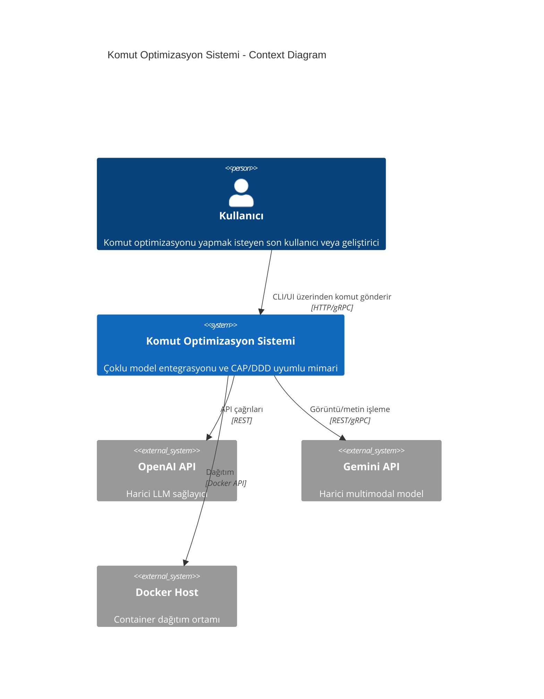
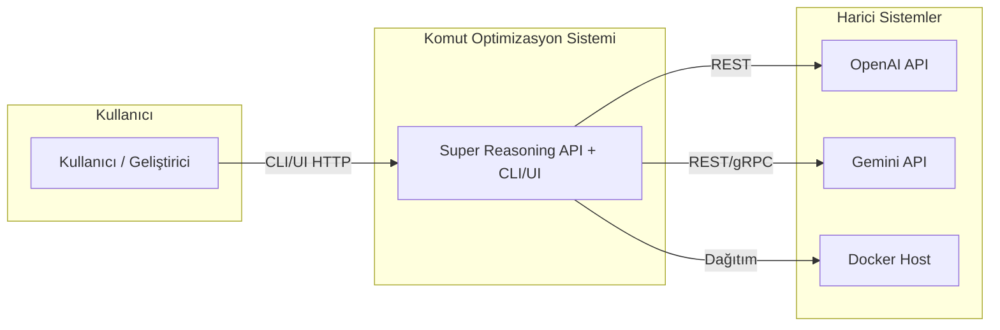
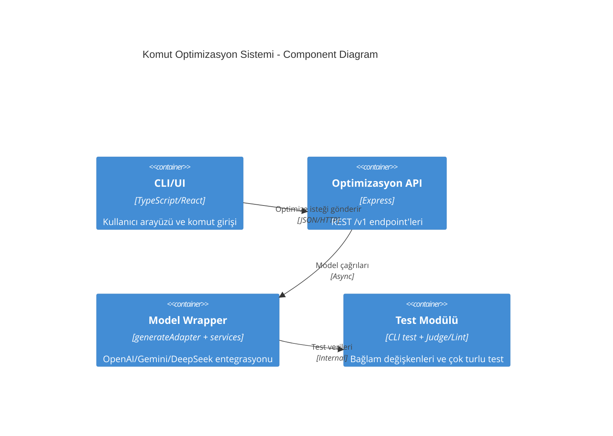
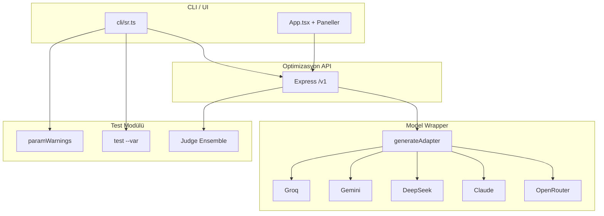

# Yapay Zeka Komut Optimizasyon Sistemi Mimarisi

Bu belge, C4 modeli, ADR, altyapı özellikleri ve kullanım senaryoları ile Komut Optimizasyon Sistemi mimarisini tanımlar.

---

## 1. C4 Model (Mermaid Diyagramları)

### Sistem Context Diyagramı



*Not: C4Context sözdizimi bazı Mermaid renderer’larda desteklenmeyebilir; C4 eklentisi veya Structurizr kullanın.*

### Bağlam Diyagramı (Alternatif – standart Mermaid)



### Bileşen Diyagramı



### Bileşen Diyagramı (Alternatif)



---

## 2. ADR (Architecture Decision Records)

| Karar No | Konu | Seçim | Nedenler |
|----------|------|--------|----------|
| **ADR-001** | CAP Teoremi Uyumu | **AP** (Availability + Partition Tolerance) | Model çağrıları asenkron yapılabildiği için kısa süreli tutarsızlık kabul edilebilir; cache ve rate limit ile availability önceliklidir. |
| **ADR-002** | DDD Uygulaması | Domain Services | Prompt üretimi (generateAdapter), Judge/Lint, Test modülü ile sınır bağlamları izole edilir. |
| **ADR-003** | Güvenlik Modeli | İstemci Tarafı İşleme + Doğrudan API | Kullanıcı verileri opsiyonel olarak sunucuya gönderilir; BYOK ile istemci tarafında anahtar tutulabilir. API anahtarları ortam değişkeni / yerel vault. |
| **ADR-004** | Çoklu Platform Desteği | Docker + Web API + CLI | 12-Factor uyumlu stateless container; Web API (Express), CLI (tsx), ileride WebAssembly/MCP. |

---

## 3. Altyapı Özellikleri (Infrastructure Specs)

### Dağıtım Prensipleri

- **12-Factor App**
  - Konfigürasyon: `config.yaml` yerine **ortam değişkenleri** (`.env`, `ENV_VAR`).
  - Build/release/run aşamaları ayrı; tek codebase.
- **Loglama:** stdout/stderr; production’da Fluentd + ELK veya cloud log toplayıcı.
- **High Availability (opsiyonel):**
  - Kubernetes: HorizontalPodAutoscaler ile otomatik ölçekleme.
  - Veritabanı: PostgreSQL (Supabase veya yönetilen); opsiyonel Redis cache.

### Ağ ve Güvenlik

- **mTLS:** İç iletişimde ileride mTLS (servisler arası).
- **API Gateway:** Nginx/Caddy reverse proxy; rate limiting (express-rate-limit); JWT (Supabase) veya x-api-key.
- **Veritabanı:**
  - **Ana veri:** PostgreSQL (prompt store, audit, org, usage).
  - **Önbellek (opsiyonel):** Redis — CAP’te availability ve semantic cache için.

---

## 4. Örnek Kullanım Senaryoları

### 4.1 CLI Optimizasyonu (Super Reasoning eşdeğeri)

**Bayraklar:**

| Bayrak | Açıklama |
|--------|----------|
| `--intent` / `--prompt` | Niyet metni (ikisi eşdeğer alias) |
| `--params` | JSON formatında ek parametreler (`contextRules`, `language`, `framework`) |
| `--iterations` | Aynı istek ile N kez üretim; son iterasyonun tam çıktısı yazdırılır (maks 10) |
| `--framework` | Stratejik çerçeve (AUTO, KERNEL, RTF, vb.) |
| `--provider` | Model sağlayıcı (groq, gemini, deepseek, claude, openrouter, huggingface) |
| `--language` | Çıktı dili (`en` veya `tr`) |
| `--domainId` | Uzmanlık alanı (`auto`, `architecture`, `frontend`, vb.) |

```bash
# Temel optimize (--prompt = --intent alias)
npx tsx cli/sr.ts optimize --prompt "CAP teoremine uygun bir sistem tasarla" --provider deepseek

# Framework ve dil ile
npx tsx cli/sr.ts optimize --intent "DDD stratejisi ile mikroservis tasarla" \
  --framework KERNEL --provider gemini --language tr

# JSON params ile ek bağlam kuralları
npx tsx cli/sr.ts optimize \
  --prompt "CAP teoremine uygun bir sistem tasarla" \
  --provider deepseek \
  --params '{"tone":"professional", "framework":"KERNEL"}'

# 3 iterasyonlu optimize (son iterasyonun tam çıktısı yazdırılır)
npx tsx cli/sr.ts optimize \
  --prompt "CAP teoremine uygun bir sistem tasarla" \
  --provider deepseek \
  --params '{"tone":"professional"}' \
  --iterations 3

# Ortam değişkenleri ile
SR_API_URL=http://localhost:4000 SR_API_KEY=xxx npx tsx cli/sr.ts optimize \
  --intent "REST API tasarla" \
  --provider groq \
  --diff
```

### 4.2 Test Modu (Bağlam Değişkenleri)

```bash
# Niyet şablonunda {{variable}} veya ${variable} kullanımı
npx tsx cli/sr.ts test \
  --intent "{{domain}} alanında {{tone}} bir prompt üret" \
  --var domain=architecture \
  --var tone=technical \
  --provider gemini
```

### 4.3 API Üzerinden (curl)

```bash
curl -X POST http://localhost:4000/v1/generate \
  -H "Content-Type: application/json" \
  -H "x-api-key: YOUR_KEY" \
  -d '{
    "intent": "CAP teoremine uygun sistem tasarla",
    "framework": "KERNEL",
    "provider": "deepseek",
    "language": "tr"
  }'
```

### 4.4 Test Modülü (Kavramsal – ileride Python/Node test süiti)

```javascript
// test_module kavramsal örnek – mevcut: CLI test --var
const context = {
  variables: { tone: "technical", domain: "architecture" },
  test_cases: [
    { input: "DDD stratejisi nedir?", expected_output: "..." }
  ]
};
// optimizer.run_test(context, model="gemini") → Judge + Lint ile doğrulama
```

---

## 5. Entegrasyonlar

| Entegrasyon | Durum | Açıklama |
|-------------|--------|----------|
| **MCP Protocol** | Planlı | `mcp_adapter` ile Claude Desktop / Cursor’dan komut alımı. |
| **T2I / I2I** | Planlı | Görüntü üretimi (Stable Diffusion / Gemini); mevcut: Gemini multimodal giriş. |
| **Multi-Model Benchmark** | Kısmen | Aynı intent ile farklı provider (groq, gemini, deepseek) karşılaştırması UI/CLI ile yapılabilir. |

### Mimari Avantajlar

- **CAP uyumu:** Asenkron işlemler ve cache ile partition tolerance; availability öncelikli.
- **Zero-Trust / BYOK:** API anahtarları ortam değişkeni veya yerel vault; sunucuya zorunlu gönderim yok.
- **Multi-Model:** Tek CLI/API ile Groq, Gemini, DeepSeek, Claude, OpenRouter seçimi.

---

## 6. Proje Eşlemesi (Mevcut Kod)

| Mimari Bileşen | Proje Karşılığı |
|----------------|------------------|
| CLI/UI | `cli/sr.ts`, `App.tsx`, `CommandPalette`, paneller |
| Optimizasyon API | `server/routes/index.ts`, `POST /v1/generate`, `GET /v1/prompts/:id/diff/export` |
| Model Wrapper | `server/lib/generateAdapter.ts`, `services/geminiService.ts`, `deepseekService.ts`, `groqService.ts`, `claudeService.ts`, `openRouterService.ts` |
| Test Modülü | `cli/sr.ts test`, `lib/paramWarnings.ts`, `services/judgeEnsemble.ts`, `services/promptLint.ts` |
| Config | `.env`, `process.env.*` (12-Factor) |
| Dağıtım | `Dockerfile`, `docker-compose.yml`, `deploy/setup-vps.sh` |

---

*Bu belge, Super Reasoning Komut Optimizasyon Sistemi mimarisinin C4, ADR ve altyapı referansıdır.*
