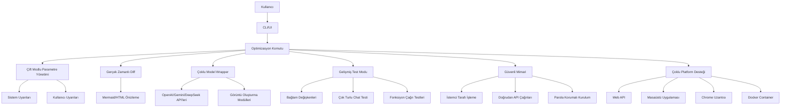

# Optimizasyon ve Test Mimarisi

Bu belge, CLI/UI üzerinden çalışan optimizasyon komutunun ve ilgili bileşenlerin mimarisini tanımlar.

## Mimari Diyagram

## Bileşen Özeti

| Bileşen | Açıklama |
|--------|----------|
| **Çift Modlu Parametre Yönetimi** | Sistem uyarıları (otomatik) ve kullanıcı uyarıları (ayarlanabilir) ile parametre kontrolü. |
| **Gerçek Zamanlı Diff** | Değişikliklerin Mermaid veya HTML önizleme ile anlık gösterimi. |
| **Çoklu Model Wrapper** | OpenAI, Gemini, DeepSeek ve görüntü oluşturma API’lerine tek arayüz. |
| **Gelişmiş Test Modu** | Bağlam değişkenleri, çok turlu sohbet ve fonksiyon çağrısı testleri. |
| **Güvenli Mimari** | İstemci tarafı işleme, doğrudan API çağrıları, parola korumalı kurulum. |
| **Çoklu Platform** | Web API, masaüstü uygulaması, Chrome uzantısı ve Docker container desteği. |

---

## Güvenli Kurulum

- **API anahtarları:** `.env` içinde; repoda yok. `SR_API_KEY`, `API_KEYS`, `GEMINI_API_KEY`, `STRIPE_SECRET_KEY` ortam değişkeni.
- **Doğrudan API:** CLI/UI kendi API uç noktanıza istek atar; BYOK desteklenir.
- **Parola koruma:** Production'da `DISABLE_API_KEY_AUTH` kapatın; `.env` izinleri `chmod 600`.

## Çoklu Platform

| Platform | Durum |
|----------|--------|
| **Web API** | Mevcut — Express `/v1/*`, OpenAPI |
| **Docker** | Mevcut — `Dockerfile`, `docker-compose.yml` |
| **Masaüstü** | Planlı — Tauri/Electron |
| **Chrome Uzantısı** | Planlı — Aynı API |

---

*Super Reasoning optimizasyon mimarisi referansı.*
