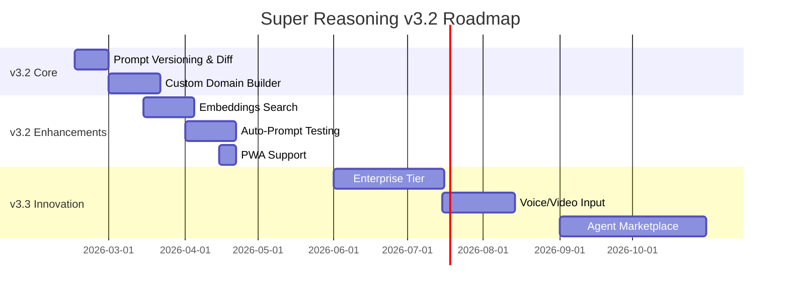

# Super Reasoning — v3.2 Roadmap

## Versiyon Bilgisi
- **Mevcut:** v3.1 (Stable)
- **Hedef:** v3.2 (Development)
- **Başlangıç:** 2026-02-13

---

## 1. Yüksek Öncelikli (v3.2 Core — 1-3 Ay)

### 1.1 Prompt Versioning & Git-like History
- Semantic versioning (semver) + diff viewer
- Branch/merge, rollback
- `prompt_versions` tablosu üzerine inşa
- UI: VersionHistoryPanel.tsx

### 1.2 Custom Domain/Framework Builder
- Kullanıcılar JSON ile kendi domain kuralları tanımlar
- UI editor + validate (Judge V3)
- `custom_domains` ve `custom_frameworks` tabloları
- Share link ile viral büyüme

### 1.3 VS Code / IDE Extension
- Intent → Master Prompt snippet insert
- OpenAPI spec genişletme
- Yeni `sdk/vscode/` repo

### 1.4 Real-time Collaboration
- Multi-user editing (CRDT via Yjs)
- Supabase Realtime entegrasyonu
- CollabPanel.tsx

---

## 2. Orta Öncelikli (v3.2 Enhancements — 3-6 Ay)

### 2.1 Embeddings-based Prompt Library Search
- Supabase pgvector ile semantic search
- OpenAI/Groq embeddings
- "Keşfet" sayfası

### 2.2 Auto-Prompt Testing & Benchmarking
- Üretilen prompt'u hedef LLM'de test et
- Judge V3 entegrasyonu + benchmark dashboard
- "Prompt ROI" metriği

### 2.3 Zapier / n8n Integrations
- Webhook + OpenAPI
- Yeni prompt → Slack/Email/GitHub push

### 2.4 Mobile PWA & Push Notifications
- Offline-first PWA (Workbox)
- Push bildirimleri

---

## 3. Düşük Öncelikli (v3.3+ Innovation — 6+ Ay)

### 3.1 Enterprise Tier ($99/ay)
- SSO (OAuth/SAML), VPC deploy, SLAs, white-label

### 3.2 Voice/Video Input (Multimodal)
- Whisper → intent transkript

### 3.3 AI Agent Marketplace
- User-generated agent pipelines, monetize

### 3.4 Prompt Analytics Dashboard (Advanced)
- Heatmaps, churn prediction ML

---

## Gantt Chart

